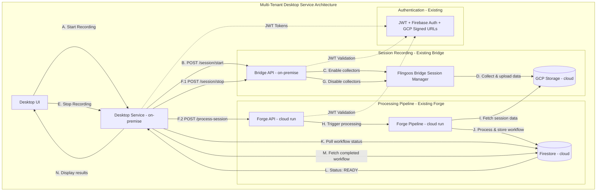

# 🏗️ **Desktop Service Architecture Update Summary**

## ✅ **Updates Completed**

### **1. Updated System Architecture Diagram**
- ✅ **Processing Pipeline**: Changed from "Local Forge CLI" to "Existing Forge"
- ✅ **Forge Components**: Updated to reflect cloud-run architecture:
  - `Backend Worker` → `Forge API - cloud run`
  - `Forge CLI Tool - local execution` → `Forge Pipeline - cloud run`
- ✅ **Data Flow**: Updated step labels to match current system:
  - `F.2 POST /sessions/{id}/process` → `F.2 POST /process-session`
  - `H. Execute forge CLI` → `H. Trigger processing`
  - `I. Download session data` → `I. Fetch session data`
  - `J. Process & upload workflow` → `J. Process & store workflow`
  - `K. Poll workflow status` → Direct polling to Firestore
  - `L. Check Firestore` → `L. Status: READY`

### **2. Architecture Documentation**
- ✅ **Added timestamp**: January 2025 architecture update note
- ✅ **Removed outdated PDF**: Deleted `ROADMAP.pdf` (902KB outdated file)
- ✅ **HTML as source**: `ROADMAP.html` is now the single source of truth

### **3. Updated Mermaid Diagram**

---

## 🎯 **Key Changes Summary**

| Component | Before | After |
|-----------|--------|-------|
| **Processing Pipeline** | Local Forge CLI | Existing Forge (cloud run) |
| **Forge API** | Backend Worker | Forge API - cloud run |
| **Forge Execution** | CLI Tool - local | Pipeline - cloud run |
| **Status Polling** | Via Backend Worker | Direct to Firestore |
| **Process Endpoint** | `/sessions/{id}/process` | `/process-session` |

---

## 📋 **Files Updated**

- ✅ **`ROADMAP.html`** - Updated architecture diagram and documentation
- ✅ **`ROADMAP.pdf`** - Removed outdated file (was 902KB, now deleted)
- ✅ **`ARCHITECTURE_UPDATE_SUMMARY.md`** - This summary document

---

## 🔄 **Current Status**

**Desktop Service Architecture:**
- ✅ **Independent Service**: Runs at `http://127.0.0.1:8844`
- ✅ **Updated Documentation**: Reflects current cloud-based Forge infrastructure
- ✅ **Single Source of Truth**: HTML roadmap is authoritative
- ✅ **Phase 11 Complete**: Ready for Phase 12 Forge integration

**Next Steps:**
- 🔄 **Phase 12**: Real Forge service integration
- 🔄 **Testing**: End-to-end workflow validation
- 🔄 **Production**: Deploy with updated architecture

---

**📅 Architecture Update Date:** January 2025  
**🎯 Status:** ✅ Complete  
**📄 Source Document:** `ROADMAP.html`
